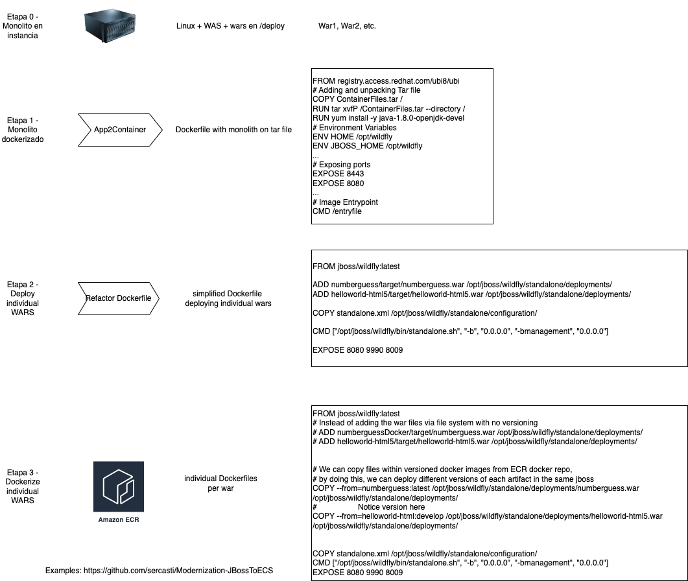

# Migrating Jboss Application to Amazon ECS (and refactoring)

This workshop migrates a jboss VM to an ECS cluster using App2Container, with an additional twist at the end, to modernize the workload by using the jboss docker base image to decouple the monolith. 

The PPT explains the App2Container service first, and then how to refactor into individual deployments.

This is the idea behing the stages of refactor:

